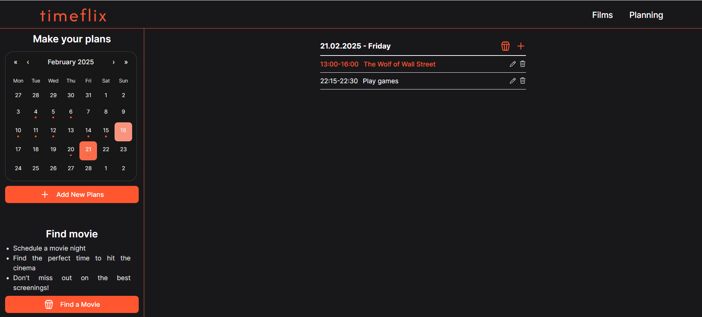

# 🎬 Timeflix - Cinema Schedule

## 📌 Project Description

Timeflix is a web application designed to help users find the best time to watch movies in cinemas while considering their personal schedules.



## 🚀 Features

- Event Calendar – Users can add and manage their personal plans within IndexedDB.
- Movie Finder – Suggests movie sessions based on your free time.
- Date Filtering – View movie sessions for a specific date.
- Modal System – Easily add events and select movies.
- Responsive Design – Optimized for all devices, from desktops to smartphones.

## 🛠️ Technologies

- React + TypeScript – Main development stack.
- Vite – Fast development and build tool.
- Tailwind CSS – Styling.
- Day.js – Date and time handling.
- React Calendar – User-friendly date selection.
- React Time Picker – Time selection component.
- IndexedDB – User plan storage.
- Framer Motion – Animations.
- React Hook Form – Form management.

## 📂 Project Structure

```
📂 timeflix
├── 📂 public
├── 📂 src
│   ├──📂 components   # UI components
│   ├──📂 data         # Mock data
│   ├──📂 helpers      # Helper functions
│   ├──📂 hooks        # Custom hooks
│   ├──📂 pages        # App pages
│   ├──📂 routes       # App routes
│   ├──📂 services     # IndexedDB logic
│   ├──📂 styles       # Shared styles
│   ├──📂 types        # TypeScript type definitions
│   ├── App.tsx
│   ├── index.css
│   ├── main.tsx
├── index.html
├── README.md          # Documentation
└── package.json       # Dependencies & scripts
```

## 🏗️ Main Modules

### 🎥 **Movie Session Selection**

The movie selection system intelligently finds available showtimes based on the user's free time, considering both individual days and the entire schedule.

#### **_How the Algorithm Works_**

1. Finds Free Time Slots – it scans the user's schedule and identifies open time slots between events.
2. Filters Relevant Movie Sessions:

- Only includes movies playing today or in the future.
- Excludes sessions that have already started.

3. Matches Movie Durations – ensures that selected movies fit within the available time slots.

#### **_Two Selection Modes_**

- Find Movies for a Specific Date – searches only for movies available on the selected day.
- Find All Available Movies – scans the entire schedule and suggests films based on all available free slots.

### 📅 **Event Planning**

The event planning system allows users to manage their personal schedules seamlessly while ensuring a conflict-free experience with movie sessions.

#### **Key Features**

- Local Storage with IndexedDB –all plans are stored locally.
- Smart Grouping & Sorting – events are automatically grouped by date and sorted in chronological order.
- Past Day Restrictions – users can view past events but cannot add or edit plans for dates that have already passed.

#### **How It Works**

1. User Creates an Event – users can add personal tasks, meetings, or activities.
2. Schedule Validation – prevents overlapping events and ensures logical start/end times.
3. Real-Time Updates – Any modification to plans instantly updates movie availability.

## ✨ Future Improvements

- User authentication and plan synchronization, import date from Google Calendar, etc.
- Integration with cinema APIs for real-time movie data.
- Enhancing Movie Selection Functionality:
    -  Select the exact date and time for a specific movie.
    - If none of the available movies fit the user's schedule, and the user's plans overlap with a movie by a short time, offer a suggestion to reschedule the plan to make it in time for the movie.

## 💻 Getting Started
### 1. Clone the Repository

Clone this repository to your local machine using the following command:

```bash
git clone https://github.com/vladochka2812/timeflix.git
```

### 2. Install Dependencies
Navigate into the project directory and install the necessary dependencies:

```bash
cd timeflix
npm install
```
### 3. Run the Development Server
After the dependencies are installed, start the development server:
```bash
npm run dev
```